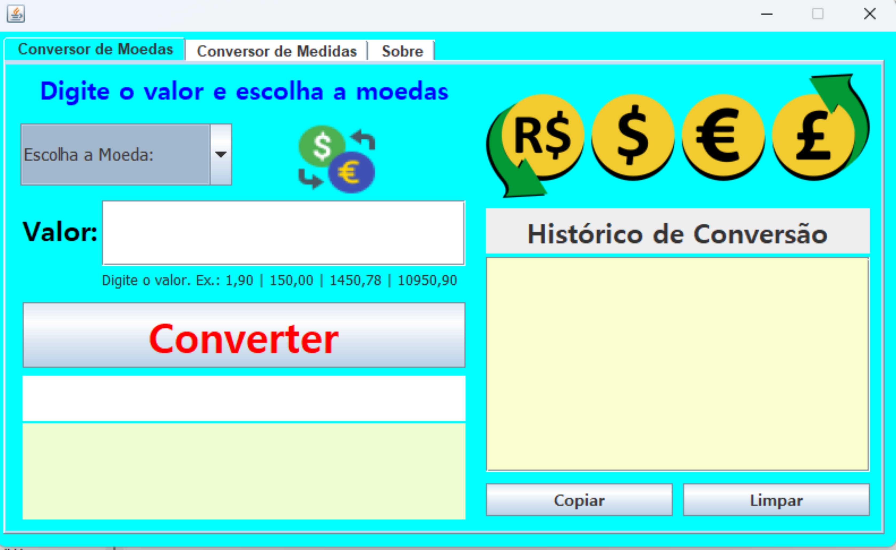
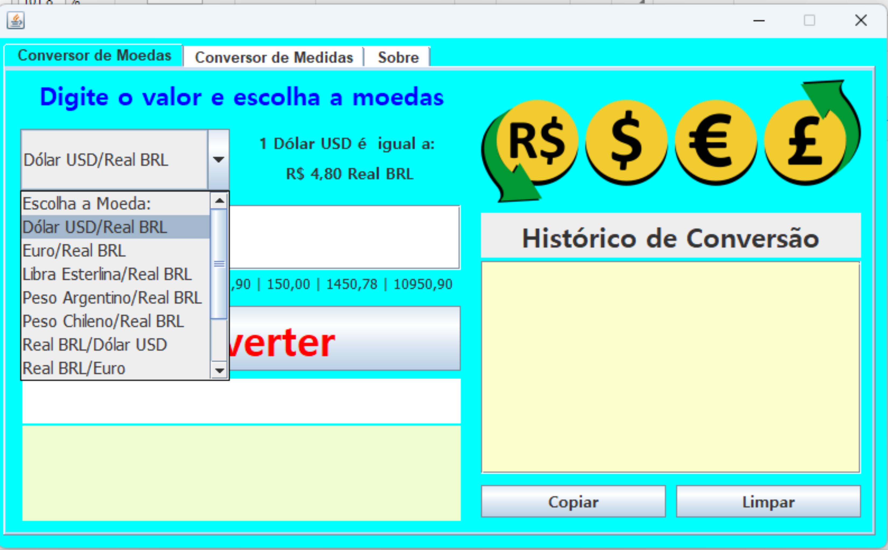
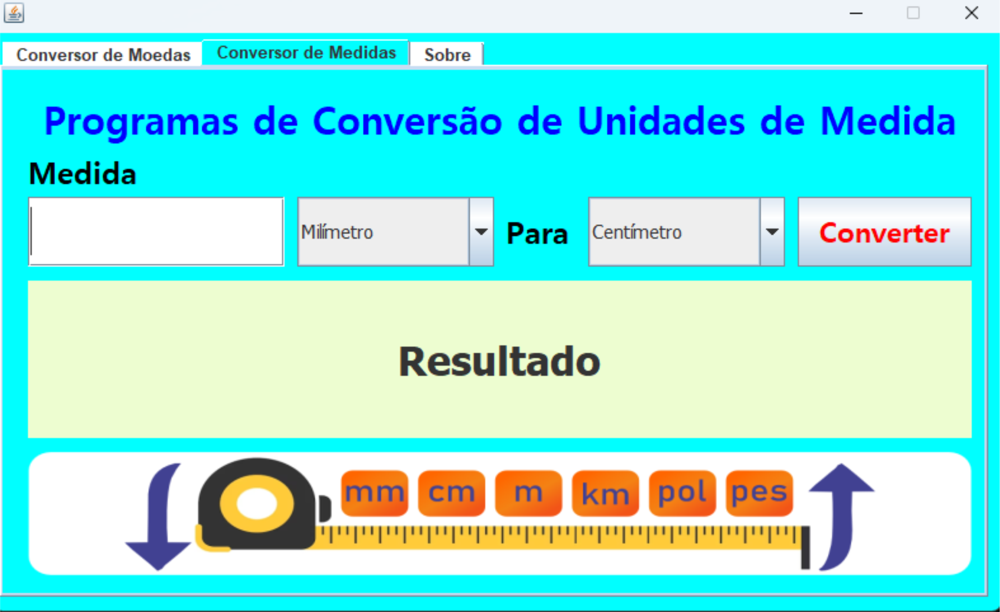
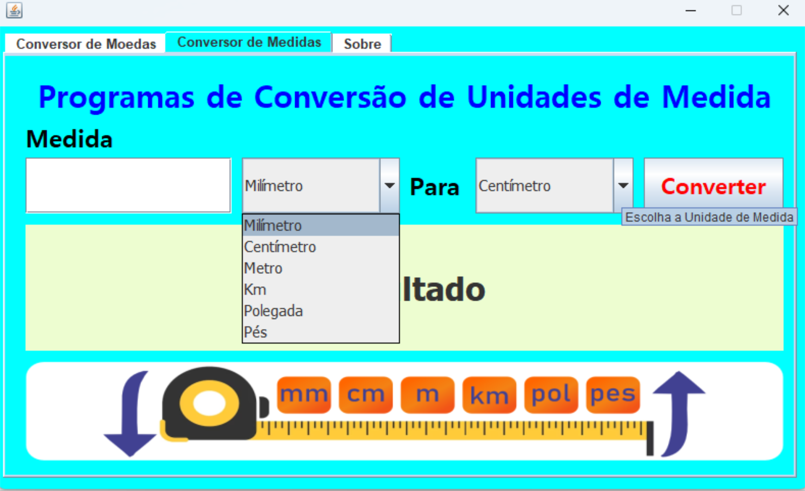
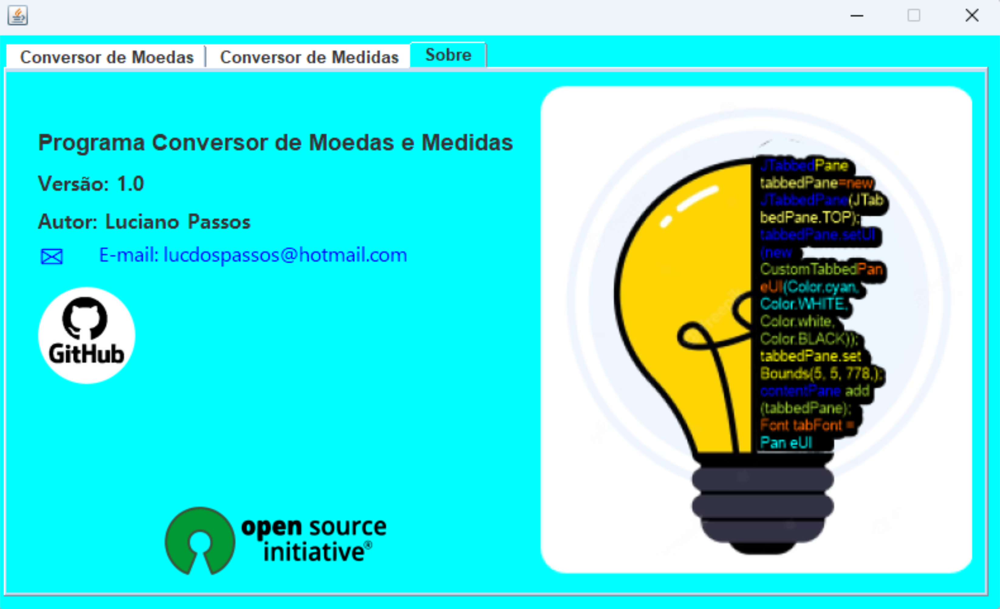

# Programa Conversor de Moedas e Medidas v1.0

Apresentamos o **Programa Conversor de Moedas e Medidas** versão 1.0, desenvolvida em Java. Esse projeto foi um desafio proposto pelo programa ONE - Oracle Next Education - Turma 5 em parceria com a Alura, para desenvolvermos um conversor de moeda utilizando a linguagem Java.

Este aplicativo oferece uma solução prática e eficiente para converter diferentes moedas e unidades de medida.

## Conversor de Moedas

Com o Conversor de Moedas, você pode facilmente converter valores entre várias moedas em tempo real, graças a uma API que atualiza as taxas de câmbio constantemente pela internet. As seguintes conversões estão disponíveis:

- Dólar USD para Real BRL
- Euro para Real BRL
- Libra Esterlina para Real BRL
- Peso Argentino para Real BRL
- Peso Chileno para Real BRL
- Real BRL para Dólar USD
- Real BRL para Euro
- Real BRL para Libra Esterlina
- Real BRL para Peso Argentino
- Real BRL para Peso Chileno

Com essa variedade de opções, você pode converter seus valores monetários com facilidade e confiança.

## Conversor de Medidas

O Conversor de Medidas é uma ferramenta versátil que permite a conversão entre diversas unidades de medida. Você pode converter entre elas as seguintes unidades:

- Milímetro
- Centímetro
- Metro
- Quilômetro
- Polegada
- Pés

## Projeto Open Source

Vale ressaltar que o Programa Conversor de Moedas e Medidas foi desenvolvido como um projeto open source. Isso significa que o código-fonte está disponível para a comunidade, permitindo que outros desenvolvedores possam contribuir, melhorar e customizar o aplicativo de acordo com suas necessidades. O autor Luciano Passos demonstra seu comprometimento com a transparência e colaboração, permitindo que outros interessados aprendam, contribuam e ampliem o projeto.

Você pode encontrar mais detalhes e colaborar com o projeto através do repositório no [GitHub](https://github.com/lucdospassos).

Portanto, com o Programa Conversor de Moedas e Medidas, você tem acesso a uma ferramenta completa e de código aberto, que torna suas conversões de moeda e medidas mais fáceis e eficientes. Desfrute dessa solução prática e atualizada para suas necessidades cotidianas!

## Imagens do Programa

A seguir, algumas imagens do programa em execução:

1. 
2. 
3. 
4. 
5. 

*Nota: As imagens apresentadas são apenas ilustrativas e podem sofrer alterações nas futuras versões do programa.*

---

*Este README foi criado utilizando Markdown. Para visualizar a formatação correta, recomendamos o uso de um visualizador compatível com Markdown.*
